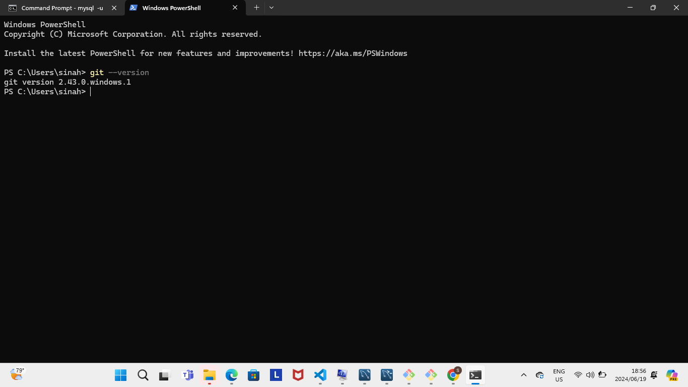
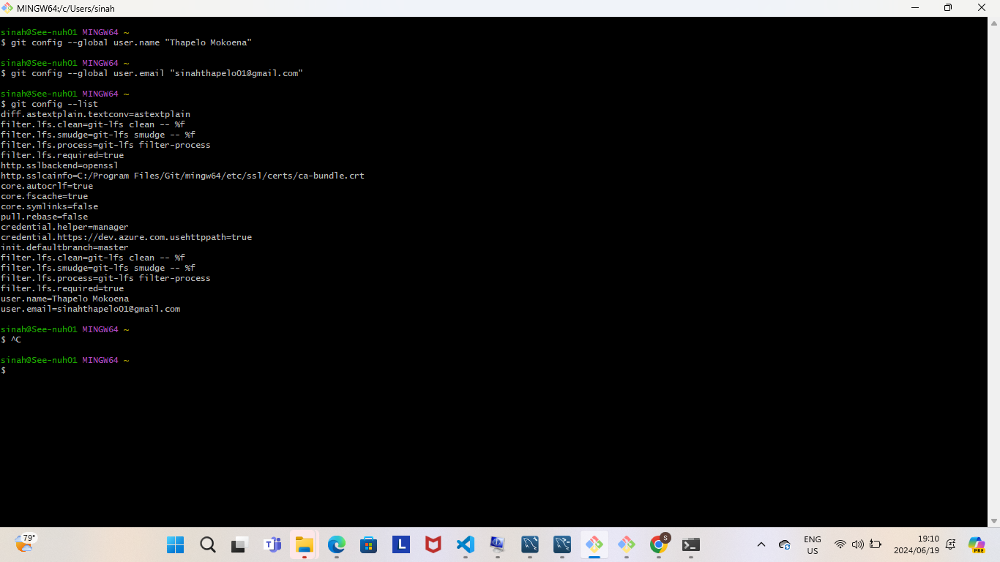
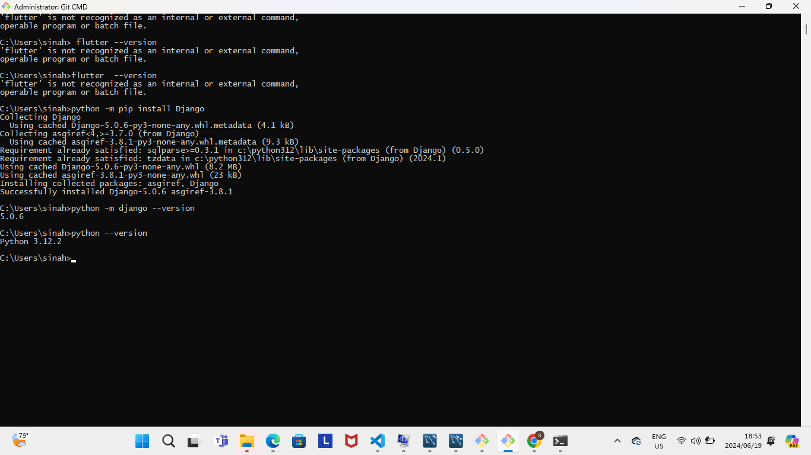
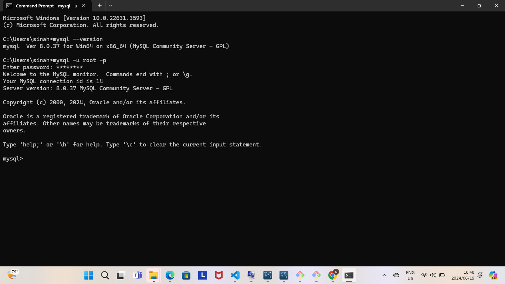
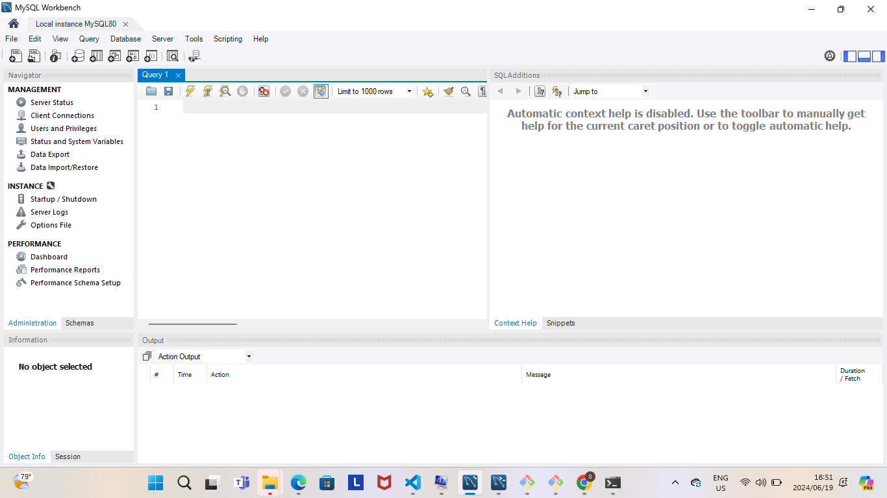
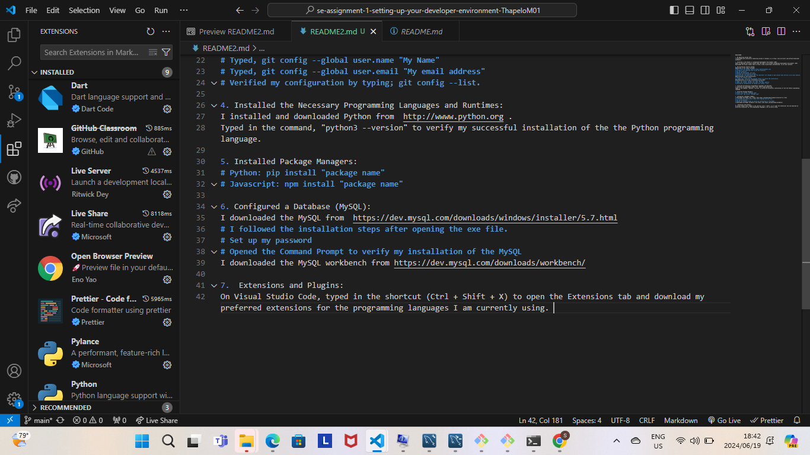

#SOLUTIONS:

1. My Operating System (OS):
I downloaded and installed an Operating System of Windows 11 on https://www.microsoft.com/software-download/windows11.

2. Installed a Text Editor or Integrated Development Environment (IDE):
Chose to download the Visual Studio Code (VS Code) as my primary Integrated Development Environment (IDE).
Downloaded the Visual Studio Code on https://code.visualstudio.com/Download, to my local machine.

3. Set Up Version Control System:
##Download of Git steps followed:
# Went to Git for Windows website https://gitforwindows.org/ 
# Clicked on the download link to get the installer.
# Rua the Installer:
# Opened the downloaded .exe file.
# Followed the installation prompts.
# Ensured that "Git Bash Here" and "Git GUI Here" are checked to add context menu entries on my local machine.
##Verification of the installation:
# Opened the Command Prompt.
# I typed "git --version" and pressed "Enter" to verify the installation.

##Configuration of my user information on Git Bash:
# Typed, git config --global user.name "My Name"
# Typed, git config --global user.email "My email address"
# Verified my configuration by typing; git config --list.

4. Installed the Necessary Programming Languages and Runtimes:
I installed and downloaded Python from  http://wwww.python.org .
Typed in the command, "python3 --version" to verify my successful installation of the the Python programming language.

5. Installed Package Managers:
# Python: pip install "package name"
# Javascript: npm install "package name"

6. Configured a Database (MySQL):
I downloaded the MySQL from  https://dev.mysql.com/downloads/windows/installer/5.7.html
# I followed the installation steps after opening the exe file.
# Set up my password
# Opened the Command Prompt to verify my installation of the MySQL

I downloaded the MySQL workbench from https://dev.mysql.com/downloads/workbench/ 

7.  Extensions and Plugins:
On Visual Studio Code, typed in the shortcut (Ctrl + Shift + X) to open the Extensions tab and download my preferred extensions for the programming languages I am currently using. 
# My installed extensions are:
# Dart
# Live Server
# Live Share
# Open Browser Preview
# Prettier Code Formatter
# Python 
# Python Debugger
# Pylance
